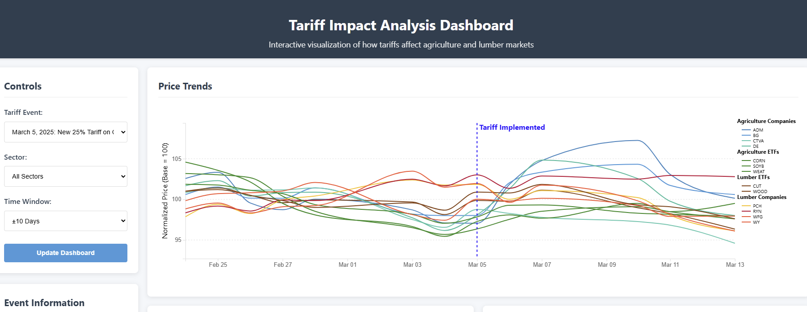

# Tariff Impact Analysis - ETL Project

This project is an **ETL pipeline and API dashboard** designed to analyze the impact of tariffs on historical market data. The application is built with **Flask**, utilizes **PostgreSQL** for data storage, processes data with **Python scripts**, and presents insights via a **D3.js front-end dashboard**.

---

## Summary

The **Tariff Impact Analysis Dashboard** provides an interactive visualization of how tariffs affect agriculture and lumber markets. It includes:

- A **Flask-based REST API** to serve tariff impact data.
- **Python scripts** for fetching and processing market data and tariff events.
- A **PostgreSQL database** to store processed data.
- An interactive **D3.js dashboard** for visualizing insights.

Explore the live demo here: 👉 [https://tariffimpact.netlify.app/](https://tariffimpact.netlify.app/)

---

## Live Demo

Explore the live demo of the Tariff Impact Analysis Dashboard:  
👉 [https://tariffimpact.netlify.app/](https://tariffimpact.netlify.app/)

---

## Overview

The **Tariff Impact Analysis Dashboard** provides an interactive visualization of how tariffs affect agriculture and lumber markets. It allows users to explore the impact of specific tariff events on market dynamics, including price trends, trading volumes, and sector-specific effects.

---

## Notable Event

**March 5, 2025: New 25% Tariff on Canadian Lumber**  
Imposed by the Trump administration to protect domestic producers, this tariff significantly impacted construction costs and lumber market dynamics. The dashboard allows users to analyze the effects of this event on various sectors and companies.

---

## Dashboard Features

The dashboard includes the following interactive features:

- **Controls**:
  - Select specific tariff events.
  - Choose sectors (e.g., Lumber Companies, Lumber ETFs, Agriculture Companies).
  - Adjust the time window (±10, ±20, ±30 days) to update the dashboard.

- **Event Information**:
  - Detailed descriptions of tariff events, including dates, affected sectors, and comprehensive descriptions.

- **Impact Summary**:
  - Displays the overall effect of the selected tariff event.
  - Highlights the average sector impact, most affected, and least affected entities.

- **Price Trends**:
  - Visual representation of price movements over time in relation to the tariff event.

- **Differential Impact**:
  - Analysis of how different sectors or companies are variably affected by the tariff.

- **Trading Volume**:
  - Insights into changes in trading volumes pre- and post-tariff implementation.

- **Sector Heatmap**:
  - A heatmap illustrating the intensity of the tariff's impact across various sectors.

---

## Key Performance Indicators (KPIs)

The following KPIs are tracked and visualized in the D3.js dashboard:

| KPI                          | Description                                      |
|------------------------------|--------------------------------------------------|
| **Market Impact Score**       | Measures the overall impact of tariffs on market data. |
| **Tariff Event Frequency**    | Number of tariff-related events over time.       |
| **Price Change Percentage**   | Percentage change in market prices due to tariffs.|
| **Affected Industries**       | Industries most impacted by tariff changes.      |

---

## Dashboard Preview

Here’s a preview of the **D3.js Dashboard**:

*Figure 1: Interactive D3.js dashboard showing tariff impact analysis.*

---

## Technologies Used

- **Backend**: Flask (Python)
- **Database**: PostgreSQL
- **Frontend**: D3.js, HTML, CSS, JavaScript
- **Data Processing**: Python (Pandas, NumPy)
- **Deployment**: Netlify (Frontend), Heroku/Netlify (Backend)
- **Containerization**: Docker

---
